<div align="center">


<h1>Omnipus</h1>

<h3>Multi-agent orchestration — sovereign, sandboxed, single binary.</h3>

<p>An opinionated agent runtime with five named coworkers, hand-off between them, a Landlock+seccomp sandbox applied to the gateway itself on Linux 5.13+, and 17 chat channels. One <code>go build</code>, no database, runs on a $10 VPS.</p>

<p>
  
  
  
  <a href="https://omnipus.ai"></a>
</p>

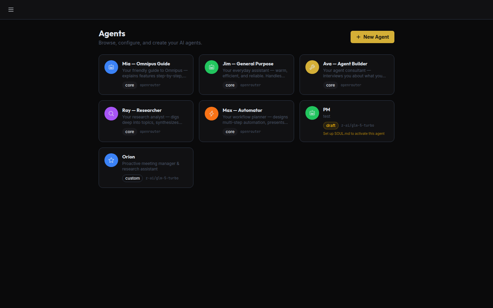

</div>

---

## Why Omnipus

Most agent frameworks give you orchestration **or** a security story. Omnipus ships both, in a single Go binary, without pulling in Postgres, Redis, or a Python runtime.

- **Five named agents out of the box** — not one general-purpose chatbot, but a team with defined roles and delegation rules.
- **Real hand-off, not fake role-play** — agents pass control through a transcript the next agent can actually read.
- **Deny-by-default security** — Landlock + seccomp applied to the gateway process before it listens (Linux 5.13+; app-level fallback elsewhere), SSRF guard wired into every outbound-HTTP tool, three-tier tool policy (allow / ask / deny), encrypted credential store.
- **Runs anywhere** — single static binary, embedded SPA, auto-generates its own encryption key on first boot. Works on a laptop, a $10 VPS, or a Raspberry Pi.

---

## The five core agents


| Agent | Role | What they do |
|---|---|---|
| **Mia** | Coach & Guide | Default agent. Onboards you to the platform, explains features, answers setup questions. |
| **Jim** | General Purpose | Warm, fast, reliable. Research, writing, analysis, coordination with other agents. |
| **Ava** | Agent Builder | Interviews you about what you need, then creates a custom agent with tools, persona, and prompt. |
| **Ray** | Researcher | Deep research with citations. Web search, web fetch, synthesis — then hands visual/automation work to Max. |
| **Max** | Automator | Browser automation, plan-then-execute, multi-step orchestration with approval gates. |

Identity (name, description, color, icon, prompt) is **locked** on core agents — users can change their model and tool policy, but can't silently replace Mia with a knock-off. Custom agents are unlimited.

---

## Live demos

All screenshots below are real conversations captured against the running binary.

### Max screenshots a page, inline

Ask Max to screenshot a URL. He chains `browser.navigate` → `browser.screenshot`, the image streams back into the chat through the media pipeline, and renders inline.

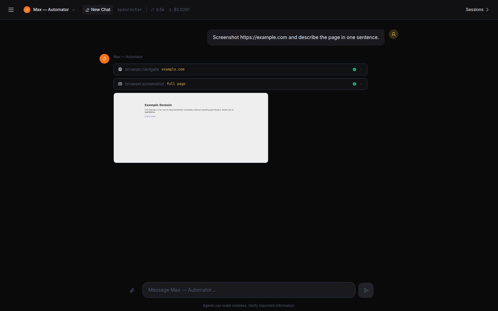

### Ray researches with sources

Ray fans out web searches, synthesises, and always prints the source URLs. His prompt is tuned to refuse to bluff — if the evidence isn't there, he says so.

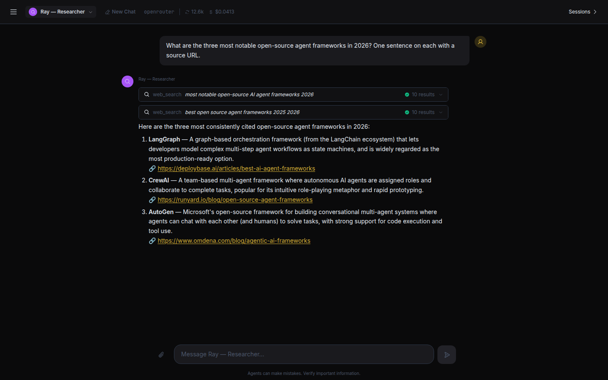

### Ava builds a custom agent live

Tell Ava what you need. She writes the persona, picks the tools, calls `system.agent.create`, and shows you a summary card for the new agent. It shows up in the roster immediately.

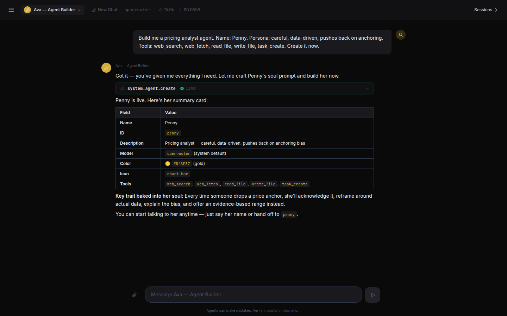

### Hand-off across agents

Ask Ray to research then hand off to Max for a screenshot. Ray researches, calls the `handoff` tool with a short brief, the session's active agent switches to Max, and Max finishes the job in the same transcript — no context loss, no copy-paste.

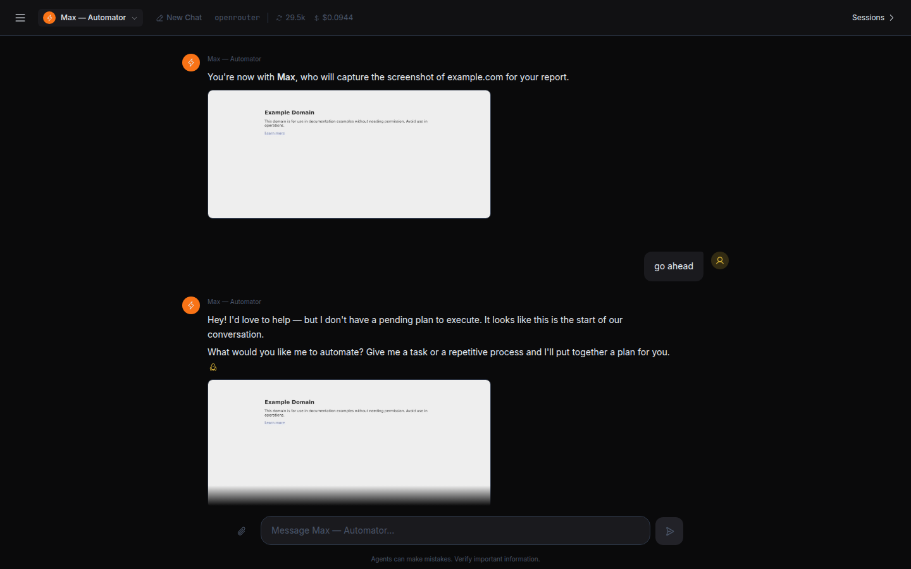

---

## What's under the hood

### Multi-agent orchestration (the differentiator)

- **Core + custom agents** — 5 named core agents ship in the binary; unlimited custom agents created through Ava or the UI.
- **Hand-off** — atomic control transfer with shared transcript and budget split.
- **Sub-agents** — spawn synchronous `subagent` or background `spawn` tool calls; cloned tool registry, budget controls, status polling.
- **Task delegation** — `task_create` / `task_update` / `task_list` wired to the heartbeat service for background execution.
- **Hook system** — observers, interceptors, approvals around every tool call.
- **Joined session store** — multi-agent conversations share a single day-partitioned JSONL transcript.

### Security posture

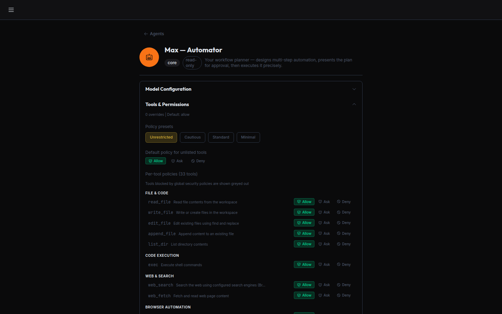

- **Kernel sandbox applied to the gateway itself** on Linux 5.13+ — Landlock (`restrict_self`) plus a seccomp filter are installed at boot, *before* `net.Listen`, so the HTTP listener never binds unsandboxed. Pure Go via `golang.org/x/sys/unix`. Modes: `enforce` (default), `permissive` (audit-only), `off`. On unsupported kernels / macOS / Windows the backend degrades to app-level checks only — see the limitations section below.
- **Three-tier tool policy per agent** — `allow` / `ask` / `deny`. Tool names and exec commands both support `*` / `?` glob patterns; deny beats allow; interactive approval streams over the WebSocket.
- **SSRF guard wired into every outbound-HTTP tool** — `web_search` (all 7 providers), `web_fetch`, the skills installer, and the exec SSRF proxy all share one `SSRFChecker.SafeClient()`. Blocks private IP ranges, link-local, cloud metadata endpoints, and IPv6 wrappings (IPv4-mapped, 6to4, Teredo); DNS is re-resolved at connect-time to close the rebinding gap. Operator allowlist via `sandbox.ssrf.allow_internal` (IPs / CIDRs / hostnames).
- **Encrypted credential store** — AES-256-GCM with Argon2id KDF; master key auto-generated on first boot, rotation via CLI.
- **Prompt-injection guard**, per-channel rate limits, per-binary exec allowlists.
- **Audit log** — structured JSONL with two-layer redaction: a sensitive-key-name layer (`password`, `api_key`, `authorization`, `bearer`, `client_secret`, and ~15 more, case-insensitive, recursing into nested maps and arrays) plus a value-pattern layer for API-key shapes, Bearer tokens, and emails.

### Security limitations and known gaps

The sandbox is deliberately scoped; be precise about what it does and doesn't do:

- **No LSM enforcement on macOS, Windows, or Linux < 5.13.** The sandbox selects a `FallbackBackend` and enforcement reduces to in-process policy checks. The BRD's Windows story (Job Objects + Restricted Tokens + DACL) is specified in Appendix A but not yet implemented.
- **Landlock ABI v4** (kernel 5.19+ / 6.x) has a `create_ruleset` incompatibility: the current `computeRights()` enumerates v1–v3 bits only, so on a v4-negotiated ruleset the call returns EINVAL and the backend downgrades to app-level checks. Tracked in [#103](https://github.com/dapicom-ai/omnipus/issues/103); out of scope for Sprint J.
- **Permissive mode downgrades to audit-only skip on kernels < 6.12.** Native permissive `landlock_restrict_self` is not available; Omnipus logs the computed policy and installs seccomp with `SECCOMP_RET_LOG`, but does not call `restrict_self`. Plan for kernel ≥ 6.12 if you need a true log-then-enforce workflow.
- **`sandbox.ssrf.allow_internal`** accepts exact hostnames, exact IPs, and CIDR ranges. Glob host patterns (`*.internal.corp`) are **not** supported yet.

When `OMNIPUS_ENV=production` is set and the sandbox is `off` or `permissive`, the gateway prints a multi-line warning to stderr at boot and every 60 seconds thereafter. The banner is not silenceable by design.

### Operator configuration

Sandbox behaviour is controlled by the `sandbox` key in `~/.omnipus/config.json`:

```json
{
  "sandbox": {
    "mode": "enforce",
    "allowed_paths": ["/var/lib/omnipus-data"],
    "ssrf": {
      "enabled": true,
      "allow_internal": ["localhost", "10.0.0.0/8", "internal.api.corp"]
    }
  }
}
```

- `mode`: `enforce` | `permissive` | `off`. Legacy `enabled: true/false` still works (maps to `enforce`/`off`).
- CLI override: `./omnipus gateway --sandbox=enforce|permissive|off` — always trumps the config value.
- Apply/Install failure on a kernel that claims Landlock support aborts boot with exit code **78** (`EX_CONFIG`); the HTTP listener never binds. Other boot failures keep exit 1.
- Status is surfaced at `/health` under `sandbox.{applied,mode,backend,disabled_by}` and in more detail at `/api/v1/security/sandbox-status`.

### Built-in tools (27 loaded by default)

Files (`read_file`, `write_file`, `edit_file`, `append_file`, `list_dir`), shell (`exec` with PTY + approval), web (`web_search`, `web_fetch`), tasks (`task_create` / `update` / `delete` / `list`), agents (`agent_list`, `subagent`, `spawn`, `spawn_status`, `handoff`, `return_to_default`), browser (`navigate`, `click`, `type`, `screenshot`, `get_text`, `wait`), skills (`find_skills`, `install_skill`), comms (`message`, `send_file`), scheduling (`cron`), and more. Additional tools register from MCP servers at runtime.

### Connectivity

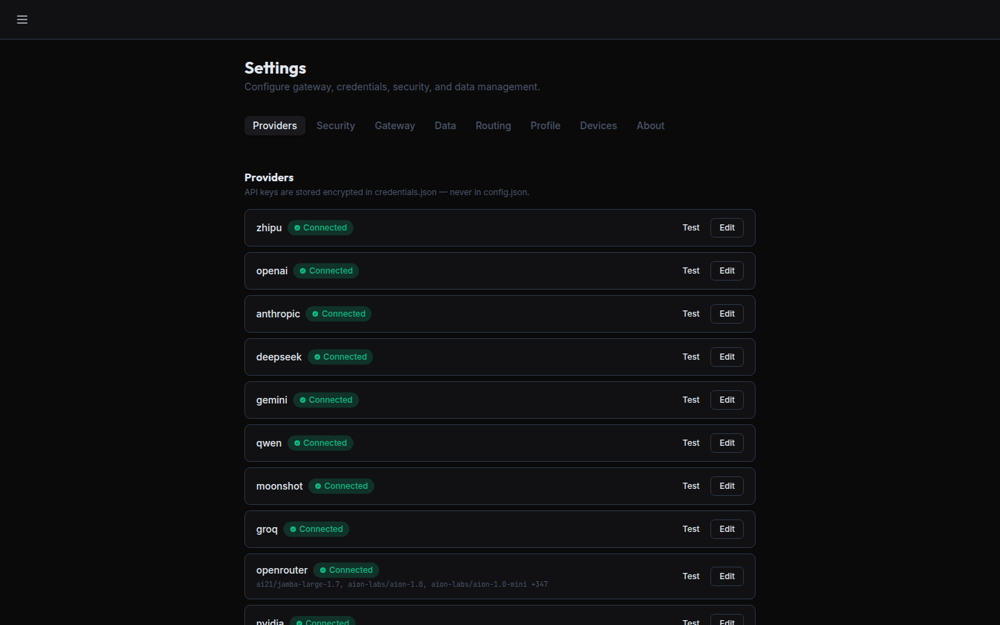

**20+ LLM providers** compiled in — OpenRouter, Anthropic, OpenAI, Google Gemini, DeepSeek, Qwen, Moonshot, Groq, Cerebras, Mistral, MiniMax, Ollama, vLLM, Azure, GitHub Copilot, Volcengine, ModelScope, NVIDIA, Avian, LongCat, Shengsuanyun, Vivgrid, Zhipu. Fallback chains, multi-key rotation, streaming, vision.

**17 chat channels** — Web Chat, Telegram, Discord, Slack, Teams, Matrix, WhatsApp, Line, QQ, WeChat, WeCom, Weixin, IRC, Feishu, DingTalk, Google Chat, OneBot, MaixCAM. All compiled in; no external services needed.

### Operator surfaces

| | |
|---|---|
| 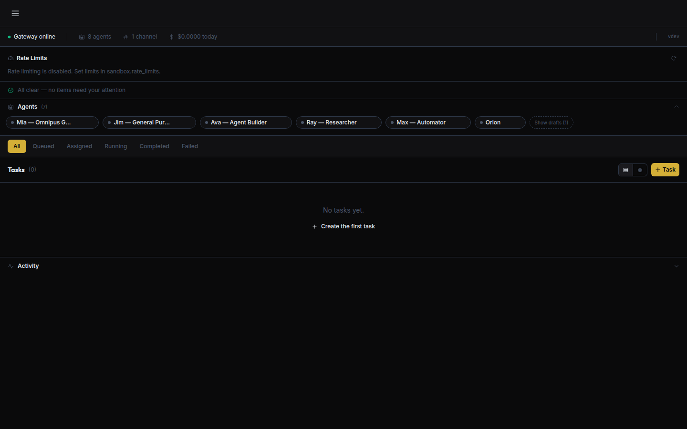 | **Command Center** — gateway status, agent summary, task board, activity feed, rate-limit events, approval queue. |
| 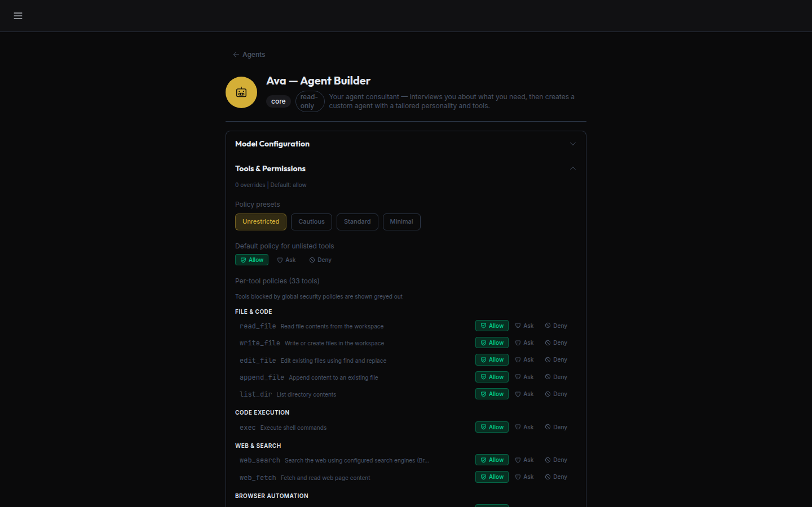 | **Agent profile** — model, temperature, per-tool policy, session history, activity timeline. Identity fields read-only on core agents. |
| 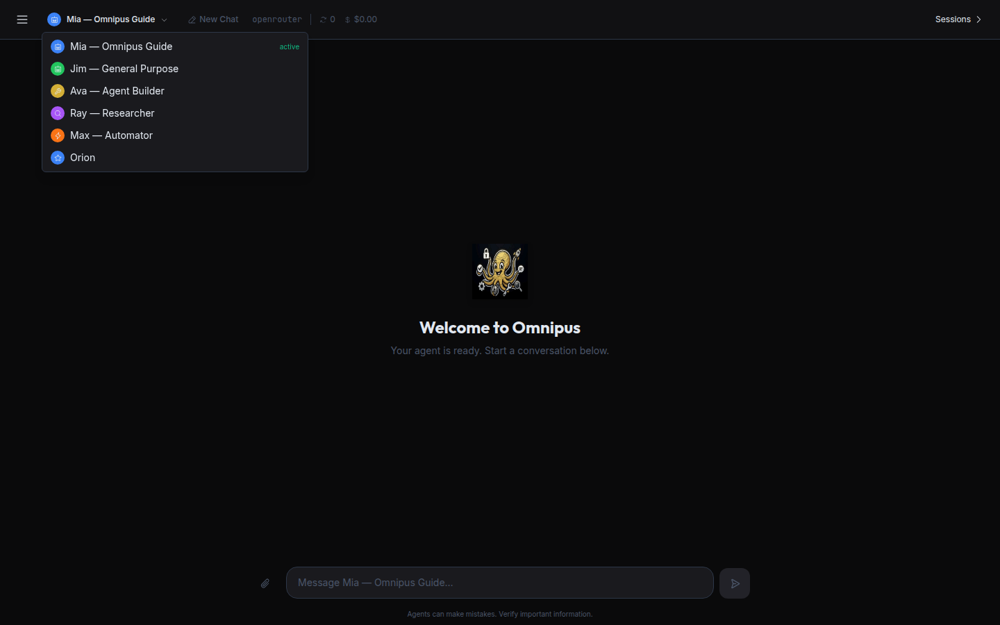 | **Agent picker** — switch who you're talking to in one click; sessions stay with the session, not the agent. |
| 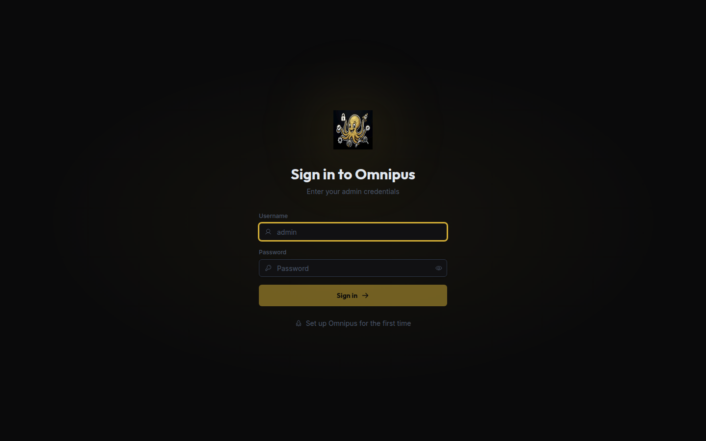 | **Dark-first UI** — "The Sovereign Deep" design system: Deep Space Black, Liquid Silver, Forge Gold accents. Chat-first, no separate canvas. |

---

## Quick start

```bash
# 1. Clone and build
git clone https://github.com/dapicom-ai/omnipus.git
cd omnipus
CGO_ENABLED=0 go build -o omnipus ./cmd/omnipus/

# 2. Run the gateway (binds 0.0.0.0:3000 by default)
./omnipus gateway
# The gateway opens two ports: 5000 (SPA + API) and 5001 (preview iframes). Open both in your firewall.

# 3. Open http://localhost:3000 and follow the onboarding wizard:
#    Welcome → Provider → API Key → Model → Admin Account → Done
```

First boot auto-generates an encryption key at `~/.omnipus/master.key` (mode `0600`). **Back it up** — losing it makes the credential store unrecoverable. For headless deployments, pre-provision via `OMNIPUS_KEY_FILE` or `OMNIPUS_MASTER_KEY`.

Rotate the key any time:

```bash
./omnipus credentials rotate --old-key-file old.key --new-key-file new.key
```

---

## Architecture

```
                    ┌────────────────────┐
                    │   Web UI (SPA)     │   React 19 · Vite 6 · shadcn/ui
                    │   embedded via     │
                    │   go:embed         │
                    └─────────┬──────────┘
                              │ HTTP · WebSocket · SSE
                    ┌─────────┴──────────┐
                    │      Gateway       │   auth, rate limits, CORS
                    └─────────┬──────────┘
                              │
         ┌────────────────────┼────────────────────┐
         │                    │                    │
   ┌─────┴──────┐      ┌──────┴──────┐      ┌──────┴──────┐
   │ Agent Loop │      │ Policy      │      │ Audit       │
   │ + Hooks    │◄────►│ Engine      │      │ Logger      │
   │ + Tools    │      │ allow/ask/  │      │ JSONL +     │
   │ + Handoff  │      │ deny        │      │ redaction   │
   └─────┬──────┘      └─────────────┘      └─────────────┘
         │
   ┌─────┴──────┐      ┌─────────────┐      ┌─────────────┐
   │  Channels  │      │  Sandbox    │      │ Credentials │
   │ 17 compiled│      │ Landlock +  │      │ AES-256-GCM │
   │ in Go      │      │ seccomp +   │      │ Argon2id KDF│
   └────────────┘      │ SSRF guard  │      └─────────────┘
                       └─────────────┘
```

Single binary. File-based storage (`~/.omnipus/` — JSON + JSONL, atomic writes). No Postgres. No Redis. WhatsApp uses pure-Go SQLite (`modernc.org/sqlite`) in its own session namespace.

---

## Tech stack

**Backend:** Go 1.21+ · `chromedp` (browser) · `whatsmeow` (WhatsApp) · `discordgo` · `telebot` · `slack-go` · `go-nostr` · `modernc.org/sqlite` · `golang.org/x/sys/unix` (Landlock, seccomp)

**Frontend:** TypeScript · React 19 · Vite 6 · shadcn/ui (Radix + Tailwind CSS v4) · AssistantUI · Phosphor Icons · Zustand · TanStack Query / Router · Framer Motion

**Storage:** File-based JSON / JSONL. Day-partitioned session transcripts with configurable retention (default 90 days) and two-layer context compression.

---

## Status

Pre-1.0. Three shipping variants:

1. **Omnipus Open Source** (primary, ships first) — single Go binary, embedded web UI, community focus. This repo.
2. **Omnipus Desktop** — Electron wrapper with native menus and auto-update.
3. **Omnipus Cloud / SaaS** — hosted variant with team features and managed infrastructure.

All three share the same Go core and the `@omnipus/ui` React components.

Active development on [`feature/next-wave`](https://github.com/dapicom-ai/omnipus/tree/feature/next-wave) · tracked in [PR #69](https://github.com/dapicom-ai/omnipus/pull/69).

---

## Specification

The full design is written down, not vibes:

| Document | Scope |
|---|---|
| [Main BRD](docs/BRD/Omnipus%20BRD.md) | 30 security + 36 functional requirements, delivery phases |
| [Appendix A](docs/BRD/Omnipus%20Windows%20BRD%20appendic.md) | Windows kernel security (Job Objects, Restricted Tokens, DACL) |
| [Appendix B](docs/BRD/Omnipus_BRD_AppendixB_Feature_Parity.md) | Feature parity requirements vs. the Claw ecosystem |
| [Appendix C](docs/BRD/Omnipus_BRD_AppendixC_UI_Spec.md) | Full UI / UX spec |
| [Appendix D](docs/BRD/Omnipus_BRD_AppendixD_System_Agent.md) | System agent and system tools |
| [Appendix E](docs/BRD/Omnipus_BRD_AppendixE_DataModel.md) | File-based data model and directory structure |

---

## Contributing

Issues, PRs, discussions — all welcome. Start with the BRD, then check the [project board](https://github.com/users/Dapicom/projects/1) for open work.

## License

MIT · [omnipus.ai](https://omnipus.ai)
