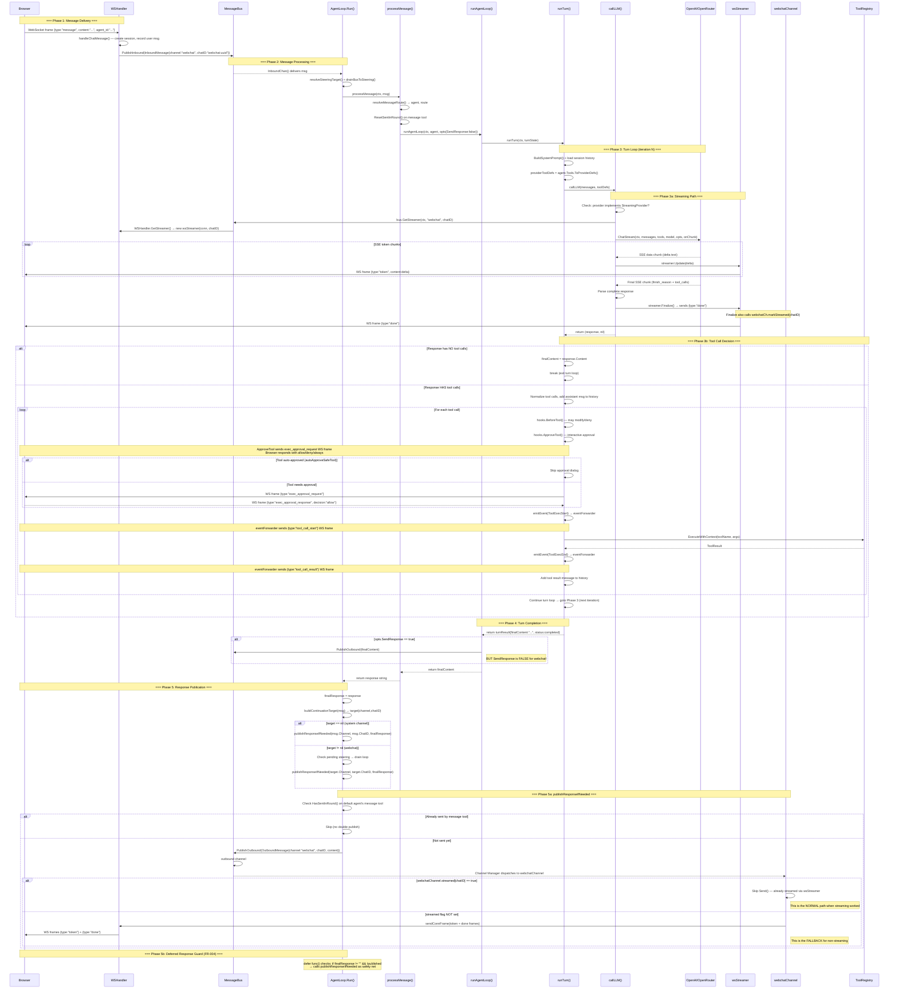

# Agent Loop Event Flow — Mermaid Diagram

## Critical Path Analysis

### The "done" frame problem:
1. `Finalize()` is called after EVERY `ChatStream()` — even when tool calls follow
2. Browser receives `{type:"done"}` → sets `isStreaming=false`, message status = "complete"
3. Tools execute (invisible to user if auto-approved)
4. Next `ChatStream()` sends new tokens → browser creates NEW assistant message? Or appends to old?
5. Second `Finalize()` → second `{type:"done"}`

### Key Question: What happens when tokens arrive AFTER a "done" frame?
- `updateLastAssistantMessage(content, false)` — finds last assistant message, appends content
- But `isStreaming` was already set to `false` by the first "done"
- The message appears "complete" then suddenly gets more text — jarring UX but functional

### The REAL gap: publishResponseIfNeeded after streaming
- After turn completes, `publishResponseIfNeeded` calls `PublishOutbound`
- `webchatChannel.Send()` checks `streamed[chatID]` — was it set?
- `Finalize()` calls `webchatCh.markStreamed(chatID)` — YES, it was set on last Finalize
- So `Send()` is a no-op — correct, response was already streamed
- BUT: `markStreamed` also has `delete(c.streamed, msg.ChatID)` in Send() — consumes the flag
- If Send() is called TWICE (deferred + explicit), second call goes through!

### Missing: What happens between iterations?
- Iteration 1: LLM streams text + tool calls → Finalize → "done" → tools execute
- Iteration 2: LLM streams response → Finalize → "done" → markStreamed
- publishResponseIfNeeded → Send() → streamed=true → skip (correct)
- Deferred guard → already published=true → skip (correct)

### Conclusion: The flow should work. The "model does nothing" issue is NOT in the agent loop logic.
